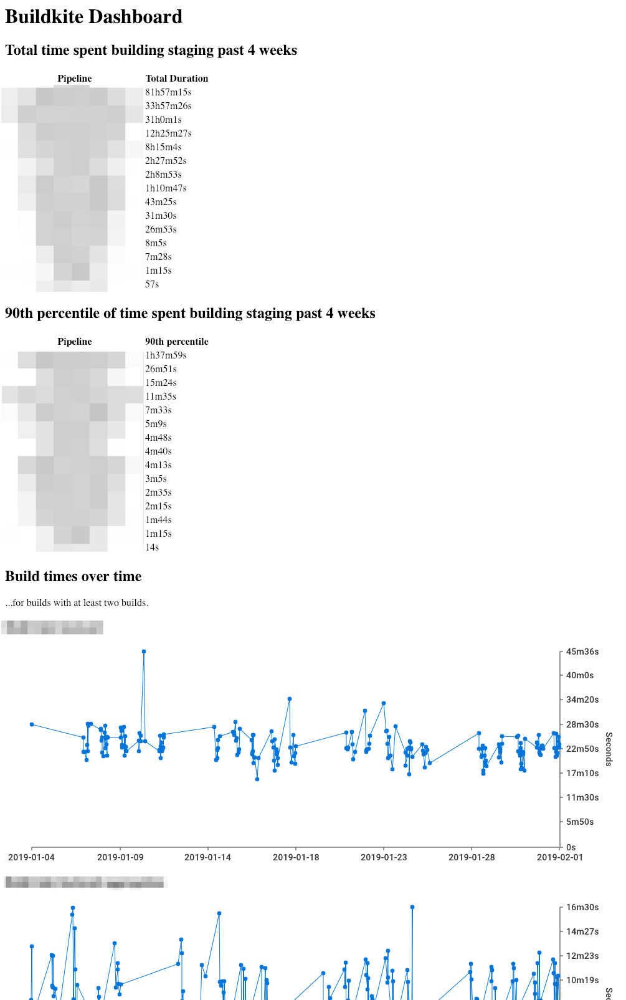

Buildkite Stats
===============
A small Buildkite dashboard useful to prioritize which pipelines a Buildkite
organization is waiting the most on.

Noteworthy details:

 * Since harvesting data can take ~30 seconds, the results are cached for (at
   most 10 minutes).

Running
-------
First execute

    go install github.com/tink-ab/buildkite-stats

then run `buildkite-stats` with the following environment variables defined:

 * `BUILDKITE_ORGANIZATION` the name of the Buildkite organization that should
   be scraped.
 * `BUILDKITE_API_TOKEN` the API token to be used for querying Buildkite. Needs
   permission `read_builds`.
 * (optionally) `PORT` if you'd like a different TCP port than default 8080.

Screenshot
----------
The UI isn't too pretty, but it does its job! ;) Pull requests prettifying it
are welcome! Currently all data is presented on a single HTML page.

